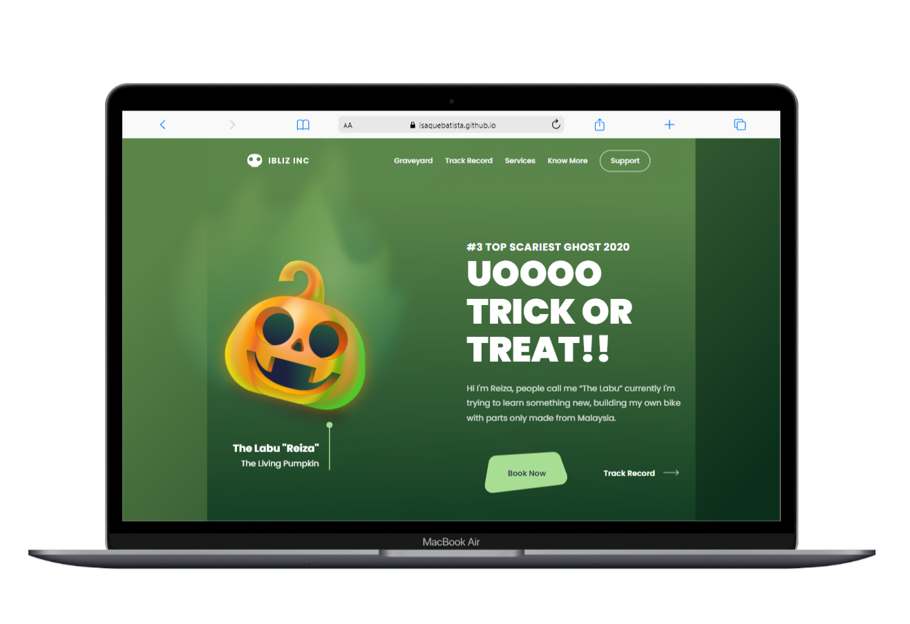
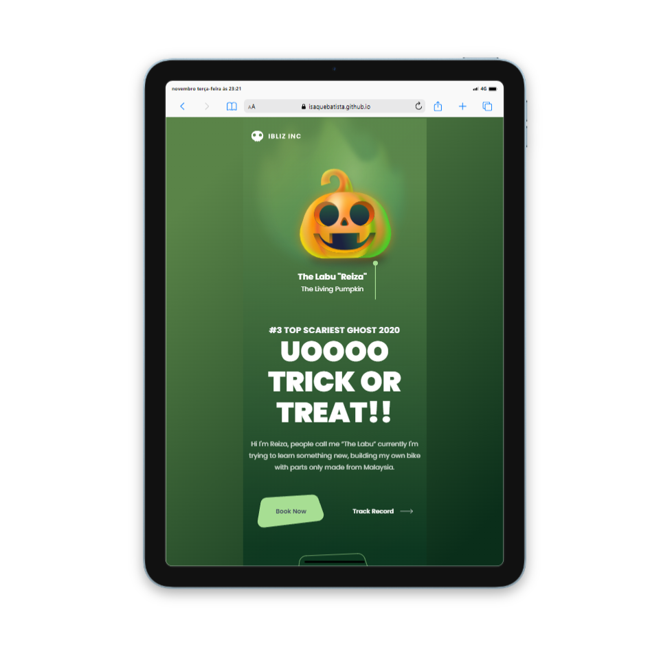
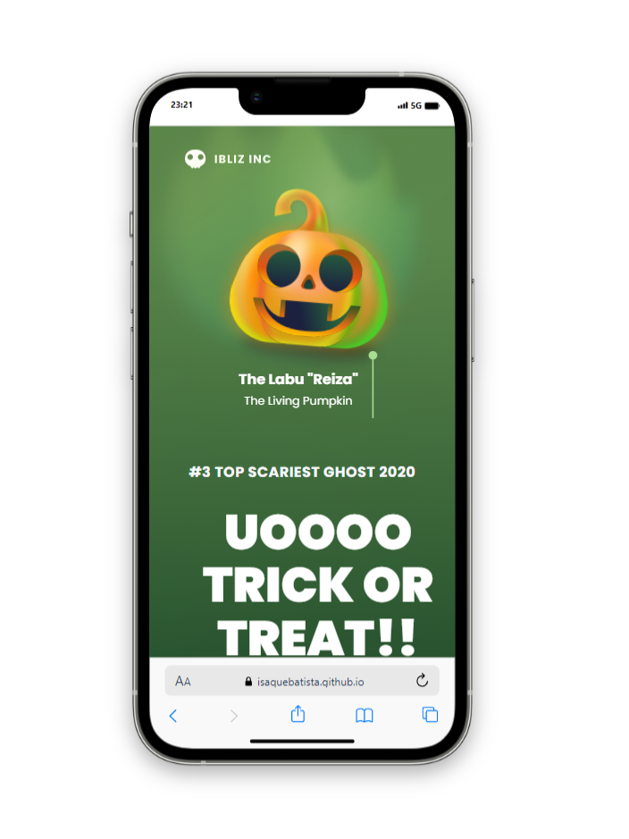

<h1>Landing Page Halloween</h1>

Deploy:
    <a>https://isaquebatista.github.io/Landing-Page-Halloween/</a>

 

> Computer
>   

 

> Tablet
>   

 

> Smartphone
>   

 

> <h3>Descrição do projeto</h3>

 

O projeto 'Landing Page Halloween' é uma aplicação web desenvolvida utilizando HTML e CSS. Com foco em responsividade e animação, o projeto se adapata a vários tipos de tela e se torna atraente aos visitantes.

---

  

 <h2>Programadores:</h2>

  

<table>
  <tr>
      <td align="center">
          <a href="#">
                 
                
                <b>Isaque Batista</b>
                
         </a>
      </td>
  </tr>
</table>
